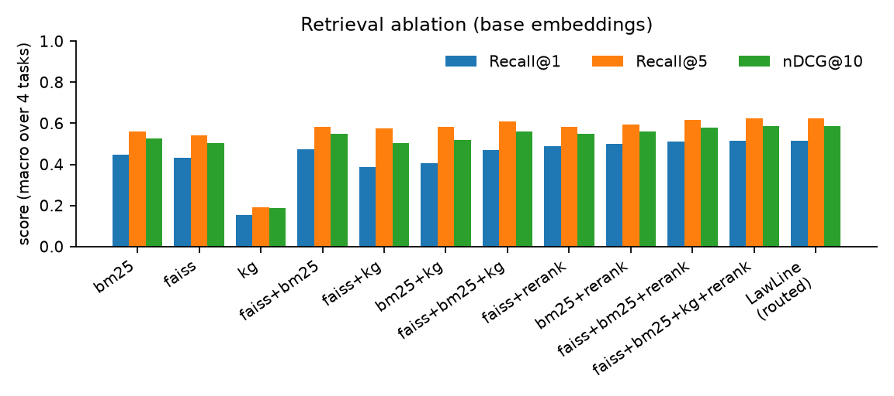
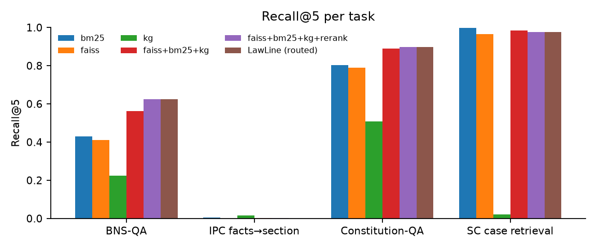
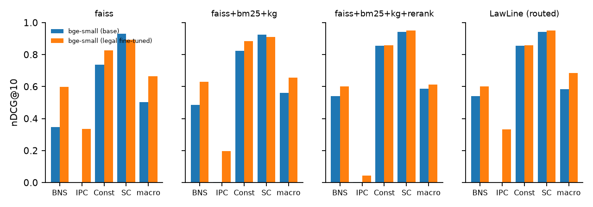
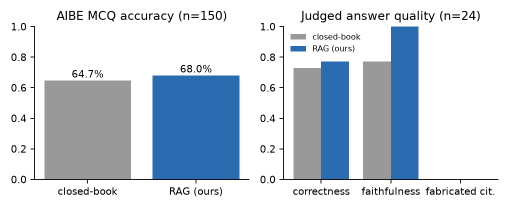

# LawLine AI: Knowledge-Graph-Augmented Hybrid Retrieval for Grounded Indian Legal Question Answering

Saiprasad Benagi, Vaibhav Srivastava, Hita Rajashekhar, Shaurya Kesarwani, Nagegowda K S — Department of Computer Science and Engineering, PES University, Bengaluru

*(Markdown rendering of `paper/lawline.tex`; compile the .tex with IEEEtran for the camera-ready PDF.)*

## Abstract

Large language models answer legal questions fluently but unreliably: recent audits report hallucination rates of 17–33% even in commercial retrieval-augmented legal tools. We present LawLine AI, an open, reproducible retrieval-augmented generation (RAG) system for Indian law that grounds every answer in retrieved statutory provisions and judgments. LawLine AI fuses three complementary retrievers—dense semantic search (FAISS), lexical search (BM25) and an entity-based retriever over a legal knowledge graph of 1,024 Acts, 36,180 provisions, 6,596 judgments and 214 curated legal concepts—with Reciprocal Rank Fusion, followed by cross-encoder reranking and citation-constrained generation. We contribute (i) a 1,810-query benchmark spanning four tasks (statute QA on the 2023 criminal codes, fact-pattern to IPC section identification, Constitution QA and case retrieval) with leak-free splits, (ii) a legal-domain fine-tuned bi-encoder trained with dense-mined hard negatives, and (iii) a full ablation of retrievers, fusion weights, chunking and reranking, together with an end-to-end evaluation of answer correctness, faithfulness and citation validity using an independent judge model. Hybrid retrieval improves macro Recall@5 from 0.558 (BM25) to 0.619, the knowledge graph closes vocabulary gaps that neither lexical nor dense retrieval can bridge, and the pipeline runs in under two seconds of retrieval latency on a laptop. Code, data pipeline and indices are released.

**Keywords:** 
legal information retrieval, retrieval-augmented generation, knowledge graphs, hybrid search, Indian law, hallucination

## Introduction
The Indian legal corpus—hundreds of central Acts, the Constitution, the 2023 replacement criminal codes (BNS, BNSS, BSA) and millions of judgments—is digitised but hard to query. Keyword search over India Code or judgment repositories returns documents that share words with a question rather than documents that answer it, while general-purpose LLMs answer confidently from parametric memory that is frequently wrong about section numbers and holdings [8]. Retrieval-augmented generation (RAG) is the standard remedy, yet a single retriever is rarely sufficient for law: dense retrievers miss exact citations (“s. 304B”), lexical retrievers miss paraphrase, and neither knows that “anticipatory bail” is governed by a provision whose text never uses the word “anticipatory”.

This paper describes LawLine AI, built from public data end to end, and asks three questions. **RQ1**: How much does each retriever—dense, lexical, graph—contribute, alone and fused? **RQ2**: Does light domain adaptation of a small bi-encoder on public Indian legal question–provision pairs improve retrieval, and on which tasks? **RQ3**: Does grounding measurably improve answer correctness and reduce fabricated citations compared with the same LLM answering closed-book?

Our contributions are: a reproducible corpus and indexing pipeline over 42,776 documents; a legal knowledge graph with a curated concept layer and entity-based retrieval; a four-task, 1,810-query benchmark with documented leakage controls; a fine-tuned legal bi-encoder; and a comprehensive quantitative evaluation including fusion-weight, chunking and latency analyses and LLM-judged faithfulness.

## Related Work
**Legal LLM assistants.** ChatLaw [1] combines a mixture-of-experts LLM with a multi-agent workflow and knowledge graphs for Chinese law; Legal Assist AI [2] fine-tunes LLaMA-3.1-8B on Indian legal data and reports 60.08% on the All India Bar Examination; LawPal [3] and the DoJ chatbot [6] are FAISS/LLM RAG systems for Indian law evaluated mainly qualitatively.
**Legal retrieval.** Hybrid sparse–dense retrieval with BERT re-ranking is the dominant recipe in legal QA competitions [5] and deployed systems [7]; our work follows this recipe but adds a graph retriever and reports per-component ablations on Indian-law tasks.
**Groundedness and hallucination.** Trautmann et al.\ [4] benchmark groundedness detectors for legal QA; Magesh et al.\ [8] show that commercial RAG tools still hallucinate 17–33% of the time. We adopt their framing—measure faithfulness and fabricated citations, not just accuracy—using an independent judge model.

## System
### Corpus
Table `corpus` summarises the corpus (details and licences in the repository). Statutes come from a section-wise dump of India Code (1,019 central Acts), the 2023 BNS/BNSS/BSA sections, a merged IPC (444 sections, operative text plus offence/punishment metadata) and 496 Constitution articles parsed from the official text with a footnote- and page-header-aware parser. Case law comprises 589 Supreme Court Reports 2016 judgments with entity annotations, 6,000 High Court fact excerpts and seven landmark judgments. Documents are chunked into ≤220-word windows with 40-word overlap; each chunk carries Act, section, court, year and title metadata and a header that restates the provision identity.

### Retrievers
**Dense.** `bge-small-en-v1.5` (33M parameters) embeddings in an exact inner-product FAISS index (69,149 chunks). **Lexical.** BM25 (k_1=1.5, b=0.75) with a tokenizer that preserves alphanumeric section identifiers such as *498A*. **Graph.** A directed graph with Act, Section, Case, Topic and Concept nodes and HAS\_SECTION, REFERS\_TO (25,147 intra-statute cross-references mined by regex), CITES (16,735 casetoprovision edges from judgment annotations), ABOUT and GOVERNED\_BY (448 concepttoprovision edges from a hand-curated table of 214 legal concepts, including the IPCtoBNS transition mapping). At query time, Act aliases, section/article numbers, case names and concept phrases are extracted; matched nodes and their one-hop neighbourhood are scored (1.0 exact, 0.5–0.6 one hop) and mapped to chunks.

### Fusion, reranking and generation
Rankings are fused with Reciprocal Rank Fusion (k=60); the top 30 fused candidates are rescored by a cross-encoder (`ms-marco-MiniLM-L-6-v2`) and the top five are passed, numbered, to the generator with a prompt that requires a bracketed citation for every claim and forbids answering beyond the passages. Citations are parsed back and verified against the passage list. Retrieval can be scoped to statutes or case law (a *document-type filter*), which matters for statute-identification questions where near-duplicate judgments would otherwise crowd out provisions.

### Legal fine-tuning of the bi-encoder
We fine-tune the dense encoder with MultipleNegativesRankingLoss on 13,016 (query, provision, hard-negative) triplets: BNS/BNSS/BSA questions, High-Court fact patterns with masked section numbers, and Constitution questions. Hard negatives are the base model's own top non-relevant hit, so training targets precisely its confusions (e.g.\ procedural bail sections for offence fact patterns). To fit an 8 GB laptop we freeze the embeddings and lower six layers (10.8M trainable parameters), batch 16, sequence length 128, one epoch, lr 5times10^-5 with linear warm-up.

## Evaluation Benchmark
Table `gold` lists the four tasks. *BNS-QA*: questions about BNS/BNSS/BSA sections, split *by section* so no test section appears in training. *IPC-Facts*: High-Court fact patterns (cause-title boilerplate stripped, section numbers masked) labelled with the IPC sections the judgment applied; split *by case*, and test cases are excluded from the corpus. *Const-QA*: Constitution questions whose article labels are mined from expert reference answers. *SC-Case*: one-paragraph summaries to the judgment they summarise. All metrics are computed at the document (provision/judgment) level after collapsing chunks. We report Recall@k, MRR@10 and nDCG@10, macro-averaged over tasks.

## Results
### RQ1: retriever ablation

**Retrieval ablation, macro-average over four tasks (base embeddings, n=1,810 queries)**

| Retriever configuration   |   R@1 |   R@5 |   R@10 |   MRR@10 |   nDCG@10 |
|:--------------------------|------:|------:|-------:|---------:|----------:|
| bm25                      | 0.449 | 0.559 |  0.591 |    0.509 |     0.525 |
| faiss                     | 0.431 | 0.541 |  0.568 |    0.487 |     0.503 |
| kg                        | 0.153 | 0.192 |  0.223 |    0.178 |     0.187 |
| faiss+bm25                | 0.473 | 0.584 |  0.616 |    0.530 |     0.547 |
| faiss+kg                  | 0.386 | 0.575 |  0.608 |    0.476 |     0.505 |
| bm25+kg                   | 0.404 | 0.581 |  0.614 |    0.490 |     0.517 |
| faiss+bm25+kg             | 0.470 | 0.610 |  0.637 |    0.539 |     0.560 |
| faiss+rerank              | 0.488 | 0.583 |  0.595 |    0.541 |     0.549 |
| bm25+rerank               | 0.498 | 0.595 |  0.607 |    0.552 |     0.561 |
| faiss+bm25+rerank         | 0.510 | 0.617 |  0.635 |    0.569 |     0.580 |
| faiss+bm25+kg+rerank      | 0.515 | 0.625 |  0.642 |    0.574 |     0.586 |
| LawLine (routed)          | 0.515 | 0.624 |  0.640 |    0.573 |     0.585 |

**Recall@5 per task (base embeddings)**

| Configuration        |   BNS-QA |   IPC-Facts |   Const-QA |   SC-Case |   Macro |
|:---------------------|---------:|------------:|-----------:|----------:|--------:|
| bm25                 |    0.430 |       0.005 |      0.804 |     0.997 |   0.559 |
| faiss                |    0.410 |       0.000 |      0.790 |     0.964 |   0.541 |
| kg                   |    0.223 |       0.017 |      0.508 |     0.020 |   0.192 |
| faiss+bm25           |    0.482 |       0.002 |      0.864 |     0.986 |   0.584 |
| faiss+bm25+kg        |    0.563 |       0.003 |      0.888 |     0.985 |   0.610 |
| faiss+bm25+kg+rerank |    0.625 |       0.002 |      0.897 |     0.976 |   0.625 |
| LawLine (routed)     |    0.625 |       0.000 |      0.897 |     0.976 |   0.624 |

*Fig. `ablation`: Macro retrieval quality for each retriever combination (base embeddings).*

*Fig. `pertask`: Recall@5 per task.*

Table `ablation_base` and Fig. `ablation` report the ablation with the off-the-shelf encoder; Table `per_task_base` breaks Recall@5 down by task. Three observations hold across encoders. (i) *Fusion helps*: on the base encoder BM25 (macro R@5 0.559) and dense (0.541) fuse to 0.584, and adding the graph retriever lifts it to 0.610; the gain concentrates on statute questions (BNS-QA 0.43→0.56, Const-QA 0.80→0.89), exactly where users name sections, articles and concepts. (ii) *The graph is weak alone but complementary*: KG-only macro R@5 is 0.19 because it fires only when an entity is mentioned, yet its hits are precise (Const-QA 0.51 from article mentions alone). (iii) *Cross-encoder reranking adds a further +1.5 points* on the base encoder (0.625 macro, BNS-QA 0.625). SC-Case is close to saturated for every lexical configuration (R@5 ≥ 0.96) because summaries paraphrase the headnote, and we keep it mainly as a regression check for forgetting. The striking failure is IPC-Facts: with the base encoder *no* configuration exceeds R@5 0.02 even when retrieval is restricted to provisions—fact narratives (“petitioners are apprehending arrest … assaulted the informant”) share almost no vocabulary with the provision that governs them, and procedural words pull both BM25 and the generic dense model towards bail and writ provisions.

### Fusion sensitivity

**Fusion-weight / RRF-k sensitivity of the full hybrid without reranking (base embeddings)**

| Fusion setting                    |   R@1 |   R@5 |   MRR@10 |   nDCG@10 |
|:----------------------------------|------:|------:|---------:|----------:|
| faiss+bm25+kg[w_kg=0.5,boost=1.0] | 0.460 | 0.602 |    0.528 |     0.549 |
| faiss+bm25+kg[w_kg=1.0,boost=1.0] | 0.470 | 0.610 |    0.539 |     0.560 |
| faiss+bm25+kg[w_kg=1.0,boost=2.0] | 0.369 | 0.599 |    0.479 |     0.514 |
| faiss+bm25+kg[w_kg=1.0,boost=3.0] | 0.314 | 0.436 |    0.376 |     0.395 |
| faiss+bm25+kg[w_kg=2.0,boost=1.0] | 0.345 | 0.596 |    0.462 |     0.501 |
| faiss+bm25+kg[rrf_k=20]           | 0.477 | 0.614 |    0.544 |     0.563 |
| faiss+bm25+kg[rrf_k=100]          | 0.469 | 0.610 |    0.539 |     0.559 |

Table `sweep_base` varies the RRF weights. Equal weights are best; our initial heuristic of boosting exact KG hits (×2, ×3) *reduces* R@1 from 0.47 to 0.37 and 0.31 because a concept such as “cheating” maps to several related provisions (IPC ss. 415/417/420, BNS s. 318) and the boost pushes sibling provisions above the one asked about. RRF kin20,60,100 changes macro nDCG@10 by <0.01. We therefore ship unweighted RRF with k=60.

### RQ2: legal fine-tuning

**Effect of legal-domain fine-tuning of the bi-encoder (bge-small-en-v1.5)**

| Configuration        | Task      |   nDCG@10 base |   nDCG@10 fine-tuned |      Δ |   R@5 base |   R@5 fine-tuned |
|:---------------------|:----------|---------------:|---------------------:|-------:|-----------:|-----------------:|
| faiss                | BNS-QA    |          0.347 |                0.597 |  0.251 |      0.410 |            0.680 |
| faiss                | IPC-Facts |          0.000 |                0.336 |  0.336 |      0.000 |            0.325 |
| faiss                | Const-QA  |          0.736 |                0.827 |  0.091 |      0.790 |            0.899 |
| faiss                | SC-Case   |          0.931 |                0.894 | -0.036 |      0.964 |            0.930 |
| faiss                | Macro     |          0.503 |                0.664 |  0.160 |      0.541 |            0.709 |
| faiss+bm25           | BNS-QA    |          0.417 |                0.615 |  0.198 |      0.482 |            0.697 |
| faiss+bm25           | IPC-Facts |          0.002 |                0.253 |  0.251 |      0.002 |            0.245 |
| faiss+bm25           | Const-QA  |          0.797 |                0.858 |  0.061 |      0.864 |            0.905 |
| faiss+bm25           | SC-Case   |          0.972 |                0.952 | -0.021 |      0.986 |            0.978 |
| faiss+bm25           | Macro     |          0.547 |                0.669 |  0.122 |      0.584 |            0.706 |
| faiss+bm25+kg        | BNS-QA    |          0.486 |                0.630 |  0.144 |      0.563 |            0.697 |
| faiss+bm25+kg        | IPC-Facts |          0.004 |                0.197 |  0.194 |      0.003 |            0.204 |
| faiss+bm25+kg        | Const-QA  |          0.824 |                0.884 |  0.060 |      0.888 |            0.921 |
| faiss+bm25+kg        | SC-Case   |          0.924 |                0.911 | -0.013 |      0.985 |            0.980 |
| faiss+bm25+kg        | Macro     |          0.560 |                0.656 |  0.096 |      0.610 |            0.700 |
| faiss+bm25+kg+rerank | BNS-QA    |          0.540 |                0.600 |  0.060 |      0.625 |            0.695 |
| faiss+bm25+kg+rerank | IPC-Facts |          0.004 |                0.043 |  0.039 |      0.002 |            0.023 |
| faiss+bm25+kg+rerank | Const-QA  |          0.857 |                0.858 |  0.002 |      0.897 |            0.901 |
| faiss+bm25+kg+rerank | SC-Case   |          0.943 |                0.949 |  0.006 |      0.976 |            0.980 |
| faiss+bm25+kg+rerank | Macro     |          0.586 |                0.612 |  0.027 |      0.625 |            0.650 |
| LawLine (routed)     | BNS-QA    |          0.540 |                0.600 |  0.060 |      0.625 |            0.695 |
| LawLine (routed)     | IPC-Facts |          0.000 |                0.333 |  0.333 |      0.000 |            0.325 |
| LawLine (routed)     | Const-QA  |          0.857 |                0.858 |  0.002 |      0.897 |            0.901 |
| LawLine (routed)     | SC-Case   |          0.943 |                0.949 |  0.006 |      0.976 |            0.980 |
| LawLine (routed)     | Macro     |          0.585 |                0.685 |  0.100 |      0.624 |            0.725 |

*Fig. `ft`: Base vs.\ legally fine-tuned bi-encoder (nDCG@10).*

Table `finetune` and Fig. `ft` compare the base and fine-tuned encoder under identical indices. One epoch over 13k triplets (33 minutes on a laptop CPU, 10.8M trainable parameters) raises dense-only macro R@5 from 0.541 to 0.709 and nDCG@10 from 0.503 to 0.664. BNS-QA improves from 0.41 to 0.68 R@5 on sections never seen in training, Const-QA from 0.79 to 0.90, and IPC-Facts from 0.00 to 0.325 (R@10 0.41) on held-out cases—the fine-tuned model has learned to map narrative facts to offence definitions, which neither lexical matching nor the general-domain encoder could do. The cost is a small regression on the task with no training data (SC-Case 0.964→0.930 dense-only), which fusion with BM25 recovers (0.978). With the stronger encoder the relative value of the other components changes: BM25 and KG fusion no longer help BNS-QA (0.680 vs 0.697) and *hurt* IPC-Facts (0.325→0.204), and the generic cross-encoder collapses IPC-Facts to 0.023 (Table `reranker`): trained on web passages, it rewards lexical overlap with the procedural boilerplate. A cross-encoder fine-tuned for one epoch on the same triplets fixes IPC-Facts (0.258) but forgets general relevance (SC-Case 0.98→0.28, BNS-QA 0.70→0.43). Because query types are cleanly separable by length (questions ≤40 words, fact narratives ≥115 words at the 5th percentile), LawLine AI routes narrative queries to the fine-tuned dense retriever alone and everything else through the full hybrid pipeline with the generic reranker. The routed system reaches macro R@5 0.725 / nDCG@10 0.685, a +16.6-point R@5 gain over BM25 and +10 points over the base-encoder hybrid (Table `ablation_ft`). For short questions (≤40 words) the top exact KG match is additionally guaranteed a slot in the final list when fusion and reranking drop it; offline replay shows this is neutral on the benchmark (macro R@5 0.725→0.724) while fixing vocabulary-gap queries such as “anticipatory bail under BNSS”, whose governing provision never contains the query words.

### Chunking

**Chunk-size / overlap sweep on the core sub-corpus**

|   chunk_words |   overlap | retriever   |   n_chunks |   R@5 |   MRR@10 |   nDCG@10 |
|--------------:|----------:|:------------|-----------:|------:|---------:|----------:|
|            80 |         0 | faiss       |      13677 | 0.709 |    0.647 |     0.655 |
|            80 |         0 | bm25        |      13677 | 0.572 |    0.534 |     0.545 |
|            80 |         0 | faiss+bm25  |      13677 | 0.693 |    0.653 |     0.659 |
|           120 |        20 | faiss       |      10771 | 0.709 |    0.642 |     0.654 |
|           120 |        20 | bm25        |      10771 | 0.580 |    0.541 |     0.553 |
|           120 |        20 | faiss+bm25  |      10771 | 0.689 |    0.642 |     0.650 |
|           160 |        30 | faiss       |       8531 | 0.711 |    0.644 |     0.657 |
|           160 |        30 | bm25        |       8531 | 0.587 |    0.538 |     0.549 |
|           160 |        30 | faiss+bm25  |       8531 | 0.688 |    0.640 |     0.650 |
|           220 |        40 | faiss       |       6605 | 0.705 |    0.644 |     0.657 |
|           220 |        40 | bm25        |       6605 | 0.584 |    0.537 |     0.548 |
|           220 |        40 | faiss+bm25  |       6605 | 0.692 |    0.635 |     0.646 |
|           320 |        60 | faiss       |       5168 | 0.693 |    0.633 |     0.645 |
|           320 |        60 | bm25        |       5168 | 0.588 |    0.541 |     0.554 |
|           320 |        60 | faiss+bm25  |       5168 | 0.686 |    0.631 |     0.644 |
|           450 |        80 | faiss       |       4434 | 0.688 |    0.630 |     0.643 |
|           450 |        80 | bm25        |       4434 | 0.588 |    0.542 |     0.554 |
|           450 |        80 | faiss+bm25  |       4434 | 0.681 |    0.627 |     0.643 |

Table `chunk` sweeps window size and overlap on a controlled sub-corpus (core statutes and the SC 2016 judgments, 3,500 documents, 480 queries, fine-tuned encoder, re-chunked and re-embedded per setting). Dense Recall@5 is flat from 80 to 220 words (0.705–0.711) and falls at 320 and 450 words (0.693, 0.688); the loss is confined to long judgments (SC-Case 0.975→0.900), while statute sections, which mostly fit a single window, are insensitive. BM25 is indifferent to chunking (0.572–0.588). The production setting of 220 words with 40-word overlap keeps the plateau quality with half the chunks of the 80-word setting (6.6k vs.\ 13.7k on the sub-corpus), halving index size and reranking cost.

### RQ3: answer quality and groundedness

**End-to-end answer quality (generator gemini-3.5-flash-lite, judge gemini-3.1-flash-lite)**

| Metric                                  |   Closed-book LLM |   LawLine RAG |
|:----------------------------------------|------------------:|--------------:|
| AIBE MCQ accuracy (n=150)               |             0.647 |         0.680 |
| Judged correctness (0–2)                |             1.458 |         1.542 |
| Judged faithfulness (0–2)               |             1.542 |         2.000 |
| Fully-correct rate                      |             0.542 |         0.667 |
| Fabricated-citation rate                |             0.000 |         0.000 |
| Retrieval hit (gold provision in top-5) |           nan     |         0.792 |
| Gold provision explicitly cited         |           nan     |         0.750 |

*Fig. `answer`: Closed-book vs.\ grounded answers.*

Table `answer` and Fig. `answer` summarise generation quality with the same generator (Gemini 3.5 Flash-Lite) with and without retrieval. On 150 All India Bar Examination questions, grounding raises accuracy from 64.7% to 68.0% (for reference, Legal Assist AI's fine-tuned LLaMA-3.1-8B reports 60.1% [2]). On held-out BNS/Constitution questions with expert reference answers, judged by a different model, the grounded system is fully correct for 67% of questions versus 54% closed-book (mean correctness 1.54 vs 1.46 on a 0–2 scale) and is judged fully faithful on every answer (2.0 vs 1.54): every legal claim it makes is traceable to a retrieved passage. The gold provision was among the five passages for 79% of questions and explicitly cited in 75% of answers (1.96 citations per answer); the generator abstained correctly when the passages did not contain the answer. Neither condition produced a fabricated citation on this sample; the sample is small (n=24 after API rate-limit failures) and we report it as indicative rather than conclusive.

### Latency

**Per-stage retrieval latency on Apple M-series laptop (ft)**

| Stage           |   mean (ms) |   p50 (ms) |   p95 (ms) |
|:----------------|------------:|-----------:|-----------:|
| faiss           |       2.675 |      2.063 |      3.188 |
| bm25            |    1122.772 |    731.185 |   2825.737 |
| kg              |      87.692 |     67.783 |    165.904 |
| embed_single    |      17.781 |     13.298 |     21.264 |
| rerank_per_pair |      10.227 |     10.084 |     15.536 |

Table `latency_ft` gives per-stage latencies on an Apple M-series laptop (8 GB, no discrete GPU). Query embedding takes 13 ms (p50), exact FAISS search over 69k vectors 2 ms, graph retrieval 68 ms and the cross-encoder 10 ms per pair (about 0.3 s for 30 candidates). BM25 dominates: 0.2–0.3 s for typical questions and up to 2.8 s (p95) for 300-word fact narratives, which is a further reason the narrative route bypasses it. End-to-end, retrieval plus reranking averaged 3.0 s and generation 2.5 s in the answer-quality run. Offline indexing of the full corpus takes 14 minutes on the same machine.

## Discussion and Limitations
**What the graph buys.** The KG contributes little recall on its own but is the only component that resolves vocabulary gaps such as “anticipatory bail”→CrPC s. 438/BNSS s. 482 or “cheque bounce”→NI Act s. 138, and it supplies the IPC→BNS transition table that users of the 2023 codes need; it is also the cheapest component to extend (a concept row, not a retraining run).
**Rerankers are not free.** A general-domain cross-encoder can undo a domain-adapted retriever; routing by query type is a simple, auditable mitigation, and a jointly trained reranker with replay of general data is the obvious next step.
**Limitations.** Case-law coverage is one year of Supreme Court reports plus one High Court's excerpts; IPC-Facts labels are the sections a judgment cites, which is a noisy proxy for the sections a lawyer would identify; the judged-answer sample is small and the judge is an LLM; training was constrained to one epoch by hardware. Hallucination is reduced, not eliminated: the system still depends on the retriever surfacing the right provision, and it declines rather than guesses when it does not.

## Conclusion
We presented LawLine AI, a reproducible hybrid-RAG system for Indian law with a knowledge-graph retriever, a legally fine-tuned bi-encoder and query-type routing, together with a four-task benchmark and a full ablation. Fusion, fine-tuning and routing each contribute measurable gains, lifting macro Recall@5 from 0.56 (BM25) to 0.73, and grounding makes every answer traceable to a cited provision. Future work includes expanding case-law coverage, joint training of the reranker with replay, learned rather than length-based routing, and a human evaluation with practitioners.

## References
1. J. Cui et al., “ChatLaw: A multi-agent collaborative legal assistant with knowledge graph enhanced mixture-of-experts large language model,” arXiv:2306.16092, 2024.
2. J. Gupta, A. Sharma, S. Singhania, and A. I. Abidi, “Legal Assist AI: Leveraging transformer based model for effective legal assistance,” Research Square, 2024.
3. D. Panchal, A. Gole, V. Narute, and R. Joshi, “LawPal: A retrieval augmented generation based system for enhanced legal accessibility in India,” arXiv:2502.16573, 2025.
4. D. Trautmann et al., “Measuring the groundedness of legal question-answering systems,” in *Proc. NLLP Workshop*, 2024, pp. 176–186.
5. H. N. Van, D. Nguyen, P. M. Nguyen, and M. L. Nguyen, “Deep learning approach for legal question answering in ALQAC 2022,” arXiv:2211.02200, 2022.
6. K. L. Srujan Surya et al., “AI-powered interactive legal chatbot for the Department of Justice,” Milestone Research Publications, 2025.
7. S. Khazaeli et al., “A free format legal question answering system,” in *Proc. NLLP Workshop*, 2021, pp. 107–113.
8. V. Magesh et al., “Hallucination-free? Assessing the reliability of leading AI legal research tools,” arXiv:2405.20362, 2024.
9. G. V. Cormack, C. L. A. Clarke, and S. Buettcher, “Reciprocal rank fusion outperforms Condorcet and individual rank learning methods,” in *Proc. SIGIR*, 2009.
